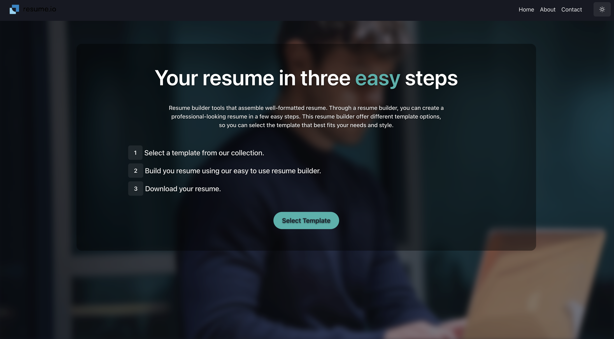
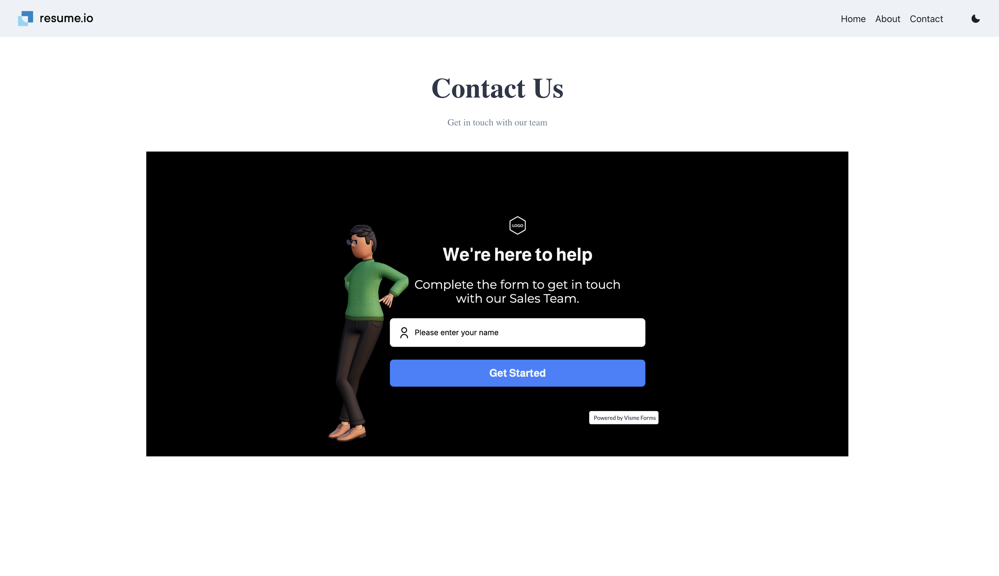

# Resume Builder Website

Welcome to our Resume Builder Website! Our website allows users to easily create professional and personalized resumes.

## Features
- User-friendly interface for creating and editing resumes
- Templates to choose from for different job industries
- PDF export option for final resume
- Dark mode for easy viewing
- Image upload for profile picture


## Getting Started
1. Clone this repository to your local machine
```bash
git clone git@github.com:Krritin/Resume-Builder.git
```
2. Navigate to the project directory
```bash
cd resume-builder
```
3. Install dependencies
```bash
npm install
```
4. Run the app
```bash
npm run start
```
5. Open http://localhost:3000 in your browser to see the application running

### Built With
- [React](https://reactjs.org/)
- [Bootstrap](https://getbootstrap.com/)
- [Chakra UI](https://chakra-ui.com/)
- [React Router](https://reactrouter.com/)
- [React Icons](https://react-icons.github.io/react-icons/)
- [React HTML to PDF](https://www.npmjs.com/package/react-html-to-pdf)
- [Visme](https://www.visme.co/) - For the animated contact form


## Pages
- **Home** - Landing page and resume builder interface
- **About** - Information about the project and team
- **Contact** - Get in touch using our interactive Visme contact form

## Screenshots

### Home Page


### About Page 


### Contact Page with Visme Form



# Resume-Builder
